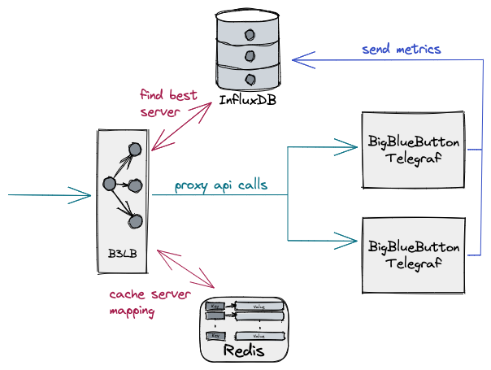

<p align="center">

</p>

[](https://www.codacy.com/gh/SLedunois/b3lb/dashboard?utm_source=github.com&amp;utm_medium=referral&amp;utm_content=SLedunois/b3lb&amp;utm_campaign=Badge_Grade)
[](https://www.codacy.com/gh/SLedunois/b3lb/dashboard?utm_source=github.com&utm_medium=referral&utm_content=SLedunois/b3lb&utm_campaign=Badge_Coverage)


[BigBlueButton](https://bigbluebutton.org/) is an open source web conferencing system for online learning.

B3LB is an open source metrics based load balancer that manages a pool of BigBlueButton servers. It works like a proxy and makes the pool of servers appears like a single server. Send standard BigBlueButton API requests and B3LB distributes those request to the least loaded BigBlueButton server in the pool.

## Architecture
A deployment of B3LB requires serveral components to get running:
*   At least 2 BigBlueButton servers containing a telegraf server agent
*   B3LB loadbalancer server
*   Redis database
*   InfluxDB database

<p align="center">

</p>

Currently, to compute the least loaded BigBlueButton server, B3LB computes the mean or average of the cpu and memory sum metric records for the last 5 minutes and take the lowest average. Check [balancer code](https://github.com/SLedunois/b3lb/blob/main/pkg/app/balancer.go) for more details.

## Installation
### BigBlueButton
Check official [BigBlueButton installation documentation](https://docs.bigbluebutton.org/2.4/install.html).
### InfluxDB
Check official [InfluxDB v2 installation documentation](https://docs.influxdata.com/influxdb/v2.1/install/).
Once your InfluxDB runs, create an InfluxDB api token using the [UI](https://docs.influxdata.com/influxdb/cloud/security/tokens/create-token/) or the following instructions:
```bash
export INFLUXDB_ORG=b3lb # B3LB InfluxDB organization
export INFLUXDB_BUCKET=bucket # B3LB InfluxDB bucket
export INFLUXDB_TOKEN=Zq9wLsmhnW5UtOiPJApUv1cTVJfwXsTgl_pCkiTikQ3g2YGPtS5HqsXef-Wf5pUU3wjY3nVWTYRI-Wc8LjbDfg== # InfluxDB API token.
influx setup --name b3lb --org $INFLUXDB_ORG --username admin --password password --token $INFLUX_TOKEN --bucket $INFLUXDB_BUCKET --retention 0 --force
```
### Telegraf
Install Telegraf on your BigBlueButton servers. Check official [Telegraf installation documentation](https://docs.influxdata.com/telegraf/v1.21/introduction/).
The following is the minimal configuraton. Add it into `telegraf.conf` file:
```toml
[global_tags]
  b3lb_host="${B3LB_HOST}"

# Configuration for telegraf agent
[agent]
  ## Default data collection interval for all inputs
  interval = "10s"
  ## Rounds collection interval to 'interval'
  ## ie, if interval="10s" then always collect on :00, :10, :20, etc.
  round_interval = true

  ## Telegraf will send metrics to outputs in batches of at most
  ## metric_batch_size metrics.
  ## This controls the size of writes that Telegraf sends to output plugins.
  metric_batch_size = 1000

  ## For failed writes, telegraf will cache metric_buffer_limit metrics for each
  ## output, and will flush this buffer on a successful write. Oldest metrics
  ## are dropped first when this buffer fills.
  ## This buffer only fills when writes fail to output plugin(s).
  metric_buffer_limit = 10000

  ## Collection jitter is used to jitter the collection by a random amount.
  ## Each plugin will sleep for a random time within jitter before collecting.
  ## This can be used to avoid many plugins querying things like sysfs at the
  ## same time, which can have a measurable effect on the system.
  collection_jitter = "0s"

  ## Default flushing interval for all outputs. Maximum flush_interval will be
  ## flush_interval + flush_jitter
  flush_interval = "10s"
  ## Jitter the flush interval by a random amount. This is primarily to avoid
  ## large write spikes for users running a large number of telegraf instances.
  ## ie, a jitter of 5s and interval 10s means flushes will happen every 10-15s
  flush_jitter = "0s"

  ## By default or when set to "0s", precision will be set to the same
  ## timestamp order as the collection interval, with the maximum being 1s.
  ##   ie, when interval = "10s", precision will be "1s"
  ##       when interval = "250ms", precision will be "1ms"
  ## Precision will NOT be used for service inputs. It is up to each individual
  ## service input to set the timestamp at the appropriate precision.
  ## Valid time units are "ns", "us" (or "µs"), "ms", "s".
  precision = ""

  ## Logging configuration:
  ## Run telegraf with debug log messages.
  debug = false
  ## Run telegraf in quiet mode (error log messages only).
  quiet = false
  ## Specify the log file name. The empty string means to log to stderr.
  logfile = ""

  ## Override default hostname, if empty use os.Hostname()
  hostname = ""
  ## If set to true, do no set the "host" tag in the telegraf agent.
  omit_hostname = false
[[outputs.influxdb_v2]]
  urls = ["${INFLUXDB_URL}"]

  ## Token for authentication.
  token = "${INFLUXDB_TOKEN}"

  ## Organization is the name of the organization you wish to write to; must exist.
  organization = "${INFLUXDB_ORG}"

  ## Destination bucket to write into.
  bucket = "${INFLUXDB_BUCKET}"
[[inputs.cpu]]
  ## Whether to report per-cpu stats or not
  percpu = true
  ## Whether to report total system cpu stats or not
  totalcpu = true
  ## If true, collect raw CPU time metrics.
  collect_cpu_time = false
  ## If true, compute and report the sum of all non-idle CPU states.
  report_active = false
[[inputs.mem]]
[[inputs.net]]
```
Edit `/etc/default/telegraf` file and add the following variables:
```bash
B3LB_HOST= # Your public bigbluebutton url like https://yourbbbhost/bigbluebutton
INFLUXDB_URL= # InfluxDB url
INFLUXDB_TOKEN=Zq9wLsmhnW5UtOiPJApUv1cTVJfwXsTgl_pCkiTikQ3g2YGPtS5HqsXef-Wf5pUU3wjY3nVWTYRI-Wc8LjbDfg== # Generated InfluxDB api token
INFLUXDB_ORG=b3lb # InfluxDB organization
INFLUXDB_BUCKET=bucket # InfluxDB bucket
```
Restart your telegraf server agent:
```bash
systemctl restart telegraf
```
### Redis
Check official [Redis installaton guide](https://redis.io/topics/quickstart). Configure Redis using persistance mode.
### B3LB load balancer
Download the [latest release](https://github.com/SLedunois/b3lb/releases).
Add a configuration file:
```yml
---
bigbluebutton:
  secret: 0ol5t44UR21rrP0xL5ou7IBFumWF3GENebgW1RyTfbU # Your B3LB secret. It works like a BigBlueButton secret.
admin:
  api_key: kgpqrTipM2yjcXwz5pOxBKViE9oNX76R # Admin API key. Used to call admin rest endpoints
balancer:
  metrics_range: -5m # metrics range used by balancer to compute the next bigbluebutton instance
  cpu_limit: 100 # max cpu % average in range (metrics_range configuration). If the metric is higher than the configuration, the bigbluebutton instance could not be balanced
  mem_limit: 100 # max memory % average in range (metrics_range configuration). If the metric is higher than the configuration, the bigbluebutton instance could not be balanced
port: 8090 # B3LB port
redis: # Redis configuration
  address:
  password:
  database: 0
influxdb: # InfluxDB Configuration
  address:
  token: 
  organization:
  bucket:
...

```

Launch B3LB with `-config` flag pointing previous config file.
## Manage B3LB
Manage your B3LB cluster using the [b3lbctl](https://github.com/SLedunois/b3lbctl) cli tool.

## Roadmap/
Checkout [B3LB public roadmap](https://github.com/users/SLedunois/projects/4).