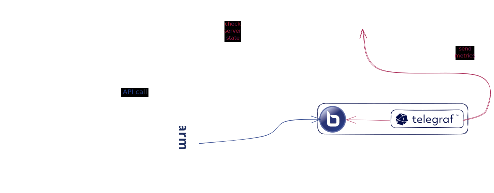

# Introduction

BigBlueSwarm is an open source metric-based multi-tenant load balancer that manages a pool of BigBlueButton servers. It works as a proxy and makes the server pool appear as a single server. Send standard BigBlueButton API requests and BigBlueSwarm distributes these requests to the least loaded BigBlueButton server in the pool.

BigBlueSwarm allows you to:

* set up a cluster of multiple BigBlueButton servers
* accurately monitor the status of your cluster and its usage
* manage one or more tenants on the same cluster
* limit the cluster usage for each tenant

## Architecture

The BigBlueSwarm infrastructure uses 3 main components:

* BigBlueSwarm: the load balancer;
* [InfluxDB](https://www.influxdata.com/): a time series database for BigBlueButton servers observability;
* [Telegraf](https://www.influxdata.com/time-series-platform/telegraf/): a server probe collecting metrics from BigBlueButton servers.

Each server sends information about its performance (CPU usage, memory usage, number of users, number of meetings) to InfluxDB through Telegraf. 

When creating a meeting, BigBlueSwarm will look in InfluxDB which server in the cluster is the most likely to receive the meeting. For this, the algorithm is based on the CPU and memory usage of the server (it is however possible to add functional constraints on the tenants).

Then, BigBlueSwarm will redirect the API calls to the server corresponding to the meeting. Once the meeting is created, BigBlueSwarm works as a proxy server between the client and BigBlueButton server hosting the meeting.

[Next page](first_steps/installation.md)
